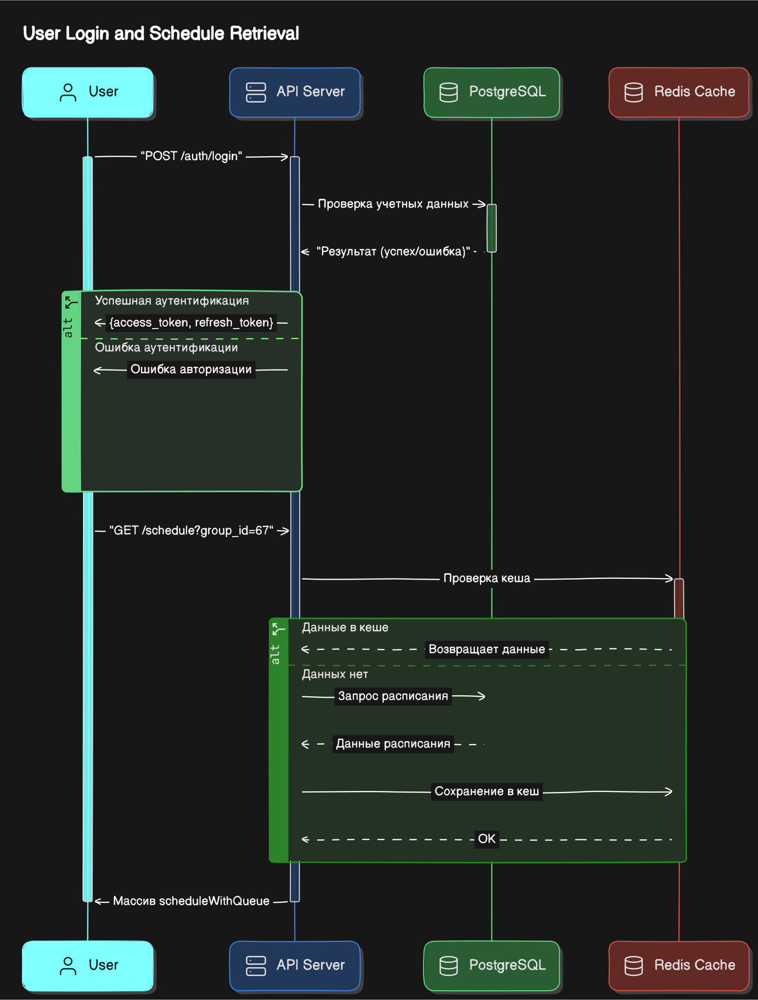

# Онлайн очередь для сдачи практики — Документация пользователя

Добро пожаловать в документацию приложения «Онлайн очередь для сдачи практики». Здесь вы найдёте подробные инструкции по установке, настройке и использованию всех доступных функций, рекомендации по устранению распространённых ошибок и советы по максимальному использованию возможностей приложения.

---

## Содержание

- [Онлайн очередь для сдачи практики — Документация пользователя](#онлайн-очередь-для-сдачи-практики--документация-пользователя)
  - [Содержание](#содержание)
  - [Обзор приложения](#обзор-приложения)
  - [Архитектура и компоненты](#архитектура-и-компоненты)
  - [Установка и запуск](#установка-и-запуск)
  - [Настройка окружения](#настройка-окружения)
  - [Аутентификация и авторизация](#аутентификация-и-авторизация)
  - [API-эндпоинты](#api-эндпоинты)
    - [Общие сведения](#общие-сведения)
    - [Эндпоинты авторизации (`/auth`)](#эндпоинты-авторизации-auth)
    - [Эндпоинты авторизации (`/profile`)](#эндпоинты-авторизации-profile)
    - [Эндпоинты групп и расписания](#эндпоинты-групп-и-расписания)
    - [Эндпоинты очереди (`/api/queues`)](#эндпоинты-очереди-apiqueues)
    - [Веб-сокеты (`/api/queues/{id}/ws`)](#веб-сокеты-apiqueuesidws)
  - [Примеры использования](#примеры-использования)
    - [Вступление в очередь (curl)](#вступление-в-очередь-curl)
    - [Получение расписания группы](#получение-расписания-группы)
  - [Расширенные возможности и настройка](#расширенные-возможности-и-настройка)
  - [Часто возникающие проблемы и их решение](#часто-возникающие-проблемы-и-их-решение)
  - [Диаграммы и схемы](#диаграммы-и-схемы)
  - [](#)
  - [Контакты и поддержка](#контакты-и-поддержка)

---

## Обзор приложения
Приложение представляет собой серверную часть (backend) для управления онлайн-очередью при сдаче практики. Основные возможности:

- Регистрация и аутентификация пользователей
- Получение списка доступных групп и расписания занятий
- Кэширование данных групп и расписания в Redis для ускорения работы
- Создание и управление очередями к практике
- Реальное время: обновления очереди через WebSocket
- Фоновый планировщик задач для закрытия/открытия очередей по расписанию

---

## Архитектура и компоненты


**Основные модули:**

- `internal/auth` — JWT-аутентификация и middleware
- `internal/handlers` — HTTP-эндпоинты
- `internal/models` — ORM-модели GORM
- `internal/storage` — подключение к БД и инициализация Redis
- `internal/tasks` — планировщик задач (открытие/закрытие очередей)
- `docs` — автоматическая генерация Swagger-документации (`swagger.json`, `swagger.yaml`)

---

## Установка и запуск

1. **Склонируйте репозиторий**:
   ```bash
   git clone https://github.com/Anabol1ks/test_hack_backend.git
   cd test_hack_backend
   ```
2. **Установите зависимости** (Go, PostgreSQL, Redis):
   - Go 1.23+
   - PostgreSQL 16+
   - Redis 6+

3. **Установите Go-зависимости**:
   ```bash
   go mod download
   ```
4. **Настройте базу данных и Redis**
   - Создайте БД в PostgreSQL (например, `testhack`)
   - Запустите Redis локально или укажите параметры подключения через переменные окружения

5. **Запустите приложение**:
   ```bash
   cp .env.example .env
   # Отредактируйте .env: укажите URL БД, секреты JWT и др.
   go run main.go
   ```
По умолчанию сервер запускается на `http://localhost:8080`.

---

## Настройка окружения
Пример файла `.env`:

```ini
# Параметры базы данных
DB_HOST=localhost
DB_PORT=5432
DB_USER=postgres
DB_PASSWORD=your_secure_password
DB_NAME=base_db

# Test database configuration
TEST_DB_HOST=localhost
TEST_DB_PORT=5432
TEST_DB_USER=postgres
TEST_DB_PASSWORD=your_test_db_password
TEST_DB_NAME=test_db

# Redis
REDIS_ADDR=localhost:6379
REDIS_PASS=

# JWT Secrets
JWT_ACCESS_SECRET=your_very_secure_jwt_access_secret_key_here
JWT_REFRESH_SECRET=your_very_secure_jwt_refresh_secret_key_here

```

---

## Аутентификация и авторизация
Используется JWT. Все защищённые эндпоинты требуют заголовок `Authorization: Bearer <access_token>`.

1. **Регистрация**: `POST /auth/register`
2. **Логин**: `POST /auth/login` — получение `access_token` и `refresh_token`
3. **Обновление токена**: `POST /auth/refresh` — получение нового `access_token` по `refresh_token`


---

## API-эндпоинты

### Общие сведения
- **Base URL:** `http://localhost:8080`
- **Content-Type:** `application/json`
- **Swagger UI:** `http://localhost:8080/swagger/index.html`  
  _Скриншот интерфейса Swagger UI:_  
  

---

### Эндпоинты авторизации (`/auth`)

| Метод | Путь              | Описание                         | Код ответа | Пример тела запроса                                                                         |
|-------|-------------------|----------------------------------|------------|--------------------------------------------------------------------------------------------|
| POST  | `/auth/register`  | Регистрация нового пользователя  | 201        | `{ "email": "user@example.com", "password": "pass123", "name": "Иван", "surname": "Иванов" }` |
| POST  | `/auth/login`     | Логин и получение токенов        | 200        | `{ "email": "user@example.com", "password": "pass123" }`                          |
| POST  | `/auth/refresh`   | Обновление access_token          | 200        | `{ "refresh_token": "<refresh_token>" }`                                              |

Ответ при успешном логине/обновлении:
```json
{
  "access_token": "eyJ...",
  "refresh_token": "eyJ..."
}
```
---
### Эндпоинты авторизации (`/profile`)
| Метод | Путь              | Описание                         | Код ответа | Пример тела запроса                                                                         |
|-------|-------------------|----------------------------------|------------|--------------------------------------------------------------------------------------------|
| GET   | `/profile`        | Получение профиля пользователя     | 200        | —                                                                  |

Ответ при успешном запросе:
```json
{
  "id": 1,
  "name": "Иван",
  "surname": "Иванов",
  "email": "user@example.com"
}
```

---

### Эндпоинты групп и расписания

| Метод | Путь         | Описание                             | Код ответа | Параметры                                                               |
|-------|--------------|--------------------------------------|------------|-------------------------------------------------------------------------|
| GET   | `/groups`    | Получение списка групп (кэш в Redis) | 200        | —                                                                       |
| GET   | `/schedule`  | Получение расписания группы          | 200        | `group_id` (query, string, обязательный)                               |

> Ответ `/schedule` содержит массив объектов с полями `schedule` (информация о практике) и `queue` (данные очереди).

---

### Эндпоинты очереди (`/api/queues`)

| Метод | Путь                      | Описание                                              | Код ответа | Требования                       |
|-------|---------------------------|-------------------------------------------------------|------------|----------------------------------|
| POST  | `/api/queues/{id}/join`   | Вступить в очередь                                     | 200        | JWT, `id` — числовой идентификатор очереди     |
| POST  | `/api/queues/{id}/leave`  | Покинуть очередь                                       | 200        | JWT, `id`                         |
| GET   | `/api/queues/{id}/status` | Статус очереди и список участников                     | 200        | JWT, `id`                         |

**Ошибки валидации:**
- `INVALID_QUEUE_ID`, `ALREADY_IN_QUEUE`, `NOT_IN_QUEUE`, `QUEUE_INACTIVE`, `QUEUE_NOT_FOUND`


---

### Веб-сокеты (`/api/queues/{id}/ws`)

Устанавливает WebSocket-соединение для получения событий:
- **URL:** `ws://localhost:8080/api/queues/{id}/ws`
- **Заголовки:** `Authorization: Bearer <token>`

```javascript
const socket = new WebSocket("ws://localhost:8080/api/queues/1/ws");
socket.onmessage = (event) => console.log("Обновление очереди:", JSON.parse(event.data));
```

---

## Примеры использования

### Вступление в очередь (curl)
```bash
curl -X POST http://localhost:8080/api/queues/1/join \
  -H "Authorization: Bearer $ACCESS_TOKEN"
```

### Получение расписания группы
```bash
curl "http://localhost:8080/schedule?group_id=67"
```

---

## Расширенные возможности и настройка

- Изменение параметров `max_participants` для каждой очереди (в модели `models.Queue`).
- Планировщик в `internal/tasks` автоматически закрывает/открывает очереди по времени, можно добавить новые задачи.
- Добавление новых эндпоинтов — создайте обработчик в `internal/handlers`, обновите маршруты в `main.go` и дополните документацию `docs/swagger.yaml`.

---

## Часто возникающие проблемы и их решение

| Проблема                                                   | Решение                                                                                                                                                     |
|------------------------------------------------------------|-------------------------------------------------------------------------------------------------------------------------------------------------------------|
| Сервер не запускается, ошибка подключения к БД             | Проверьте переменные `DB_HOST`, `DB_USER`, `DB_PASS`, `DB_NAME`. Убедитесь, что PostgreSQL запущен и доступен по указанным параметрам.                          |
| Redis не подключается                                       | Проверьте `REDIS_ADDR` и `REDIS_PASS`. Убедитесь, что Redis запущен и не требует авторизации, либо правильно указали пароль.                                   |
| Ошибка `JWT` или `invalid signature`                       | Проверьте `JWT_SECRET` и `REFRESH_SECRET` в `.env`, убедитесь, что они совпадают с теми, что используются в коде.                                                 |
| CORS-проблемы при запросах из браузера                     | Проверьте настройки CORS в `main.go`: по умолчанию разрешены все источники (`*`). Уточните необходимые домены в `AllowOrigins`.                                |
| WebSocket не подключается                                  | Убедитесь, что заголовок `Authorization: Bearer <token>` передаётся правильно. Проверьте путь `ws://.../ws` и замените протокол на `wss://` при использовании HTTPS. |

---

## Диаграммы и схемы

1. **Схема взаимодействия компонентов** (см. раздел «Архитектура и компоненты»).
2. **Диаграмма потоков данных** 

---

## Контакты и поддержка
Если у вас возникли вопросы или предложения, свяжитесь с автором:

- **GitHub:** [Anabol1ks/test_hack_backend](https://github.com/Anabol1ks/test_hack_backend)
- **Email:** your.email@example.com

Спасибо за использование приложения!

